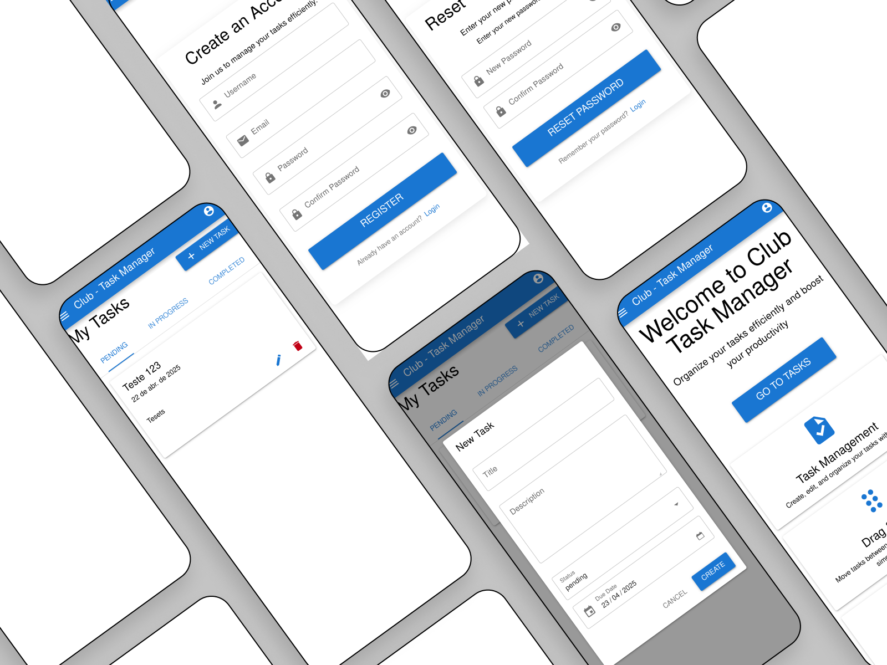

# Setup do projeto

1. Clone o repositório do `backend`:

`git clone https://github.com/andersonms1/clube-back.git`

2. Clone o repositorio do `frontend`

Entre na pasta do projeto clonado.

`cd club-back`

E crie o repositorio do front da aplicação

`git clone https://github.com/andersonms1/clube-front.git`

- A estrutura do projeto precisa seguir o padrão
```
.
├── back
├── clube-front
├── docker-compose.yml
├── Makefile
└── README.md
```

3. Volter para a raiz do projeto. Edite o arquivo `.env.example`, renomear o arquivo para `.env` e adicionar os campos necessários

4. Faça o build do docker e rode a aplicação
`docker compose build`

5. Execute a aplicação. O `docker-compose`, é responsável por levantar os serviços necessários para a arquitetura do projeto `redis` e o `mongo` 

Acesse no navegador o endereço `https://localhost:80`


